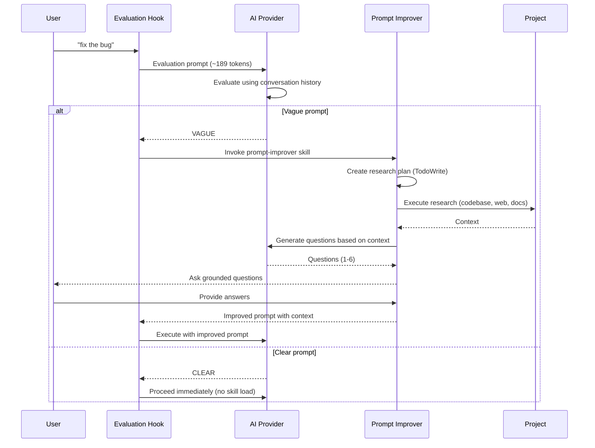

# Vague Prompt Detection and Improvement System

## Overview

The Termux AI Toolkit now includes an intelligent prompt evaluation system that automatically detects vague or unclear prompts and helps improve them through targeted research and clarifying questions.

## How It Works

The system implements the following workflow:

```
User Input ("fix the bug")
    ↓
Evaluation Hook (~189 tokens)
    ↓
Evaluate using conversation history
    ↓
    ├─── Vague Prompt Detected
    │    ↓
    │    Invoke prompt-improver skill
    │    ↓
    │    Research (codebase, web, docs)
    │    ↓
    │    Generate 1-6 grounded questions
    │    ↓
    │    User provides answers
    │    ↓
    │    Execute with improved prompt
    │
    └─── Clear Prompt Detected
         ↓
         Proceed immediately (no skill load)
```

## Components

### 1. Prompt Evaluator Hook (`hooks/prompt_evaluator.sh`)

**Purpose**: Analyzes prompts to determine if they are vague or clear.

**Features**:
- Uses a ~189 token evaluation prompt (per specification)
- Supports both OpenAI and Google Gemini
- Returns "VAGUE" or "CLEAR" classification
- Considers conversation history if available

**Usage**:
```bash
bash hooks/prompt_evaluator.sh -p "fix the bug" --api-key "$OPENAI_API_KEY"
# Output: VAGUE

bash hooks/prompt_evaluator.sh -p "Fix null pointer in user_service.py line 42" --api-key "$OPENAI_API_KEY"
# Output: CLEAR
```

**Examples of Vague Prompts**:
- "fix the bug"
- "make it better"
- "help me with code"
- "optimize this"

**Examples of Clear Prompts**:
- "Fix the null pointer exception in user_service.py line 42"
- "Optimize the database query in get_users() function to use an index"
- "Add error handling to the file upload feature in upload.js"

### 2. Prompt Improver Skill (`skills/prompt_improver.sh`)

**Purpose**: Improves vague prompts through research and question generation.

**Workflow**:
1. **Research Planning**: Creates a focused research plan (TodoWrite)
2. **Research Execution**: Gathers context from:
   - Codebase structure and recent changes
   - Project documentation (README, ARCHITECTURE)
   - Web resources (in production implementation)
3. **Question Generation**: Produces 1-6 specific, grounded questions

**Usage**:
```bash
bash skills/prompt_improver.sh -p "fix the bug" --api-key "$OPENAI_API_KEY"
# Output: JSON array of clarifying questions
```

**Example Output**:
```json
[
  "Which component or file is experiencing the bug?",
  "What is the expected behavior vs. the actual behavior?",
  "Are there any error messages or stack traces?",
  "When does this bug occur (always, intermittently, specific conditions)?",
  "Has this worked correctly before, or is it a new feature?"
]
```

### 3. Integration with ai_cli.sh

The prompt evaluation system is automatically integrated into the main AI CLI:

**Automatic Evaluation**: Every prompt is evaluated before being sent to the AI (unless disabled)

**Seamless UX**: 
- Clear prompts proceed immediately with a single confirmation
- Vague prompts trigger the improvement workflow with user interaction
- Users can always bypass evaluation if needed

## Configuration

### Enable/Disable Evaluation

Set the `PROMPT_EVALUATION` environment variable:

```bash
# Enable (default)
export PROMPT_EVALUATION=1

# Disable
export PROMPT_EVALUATION=0
```

Or per-command:
```bash
PROMPT_EVALUATION=0 bash ai_cli.sh -p "fix the bug"
```

### Configure in Environment File

Edit `~/.config/termux-ai/env`:
```bash
# Enable/disable vague prompt detection (default: 1 = enabled)
export PROMPT_EVALUATION=1
```

## Usage Examples

### Example 1: Vague Prompt (Interactive Improvement)

```bash
$ bash ai_cli.sh -p "fix the bug"
[INFO] Evaluating prompt clarity...
[WARN] Prompt appears to be vague. Invoking prompt-improver skill...
[INFO] Creating research plan for vague prompt...
[INFO] Executing research plan...
[INFO] Researching codebase...
[INFO] Researching documentation...
[INFO] Generating clarifying questions...
[INFO] To better assist you, please answer these questions:

  1. Which file or component has the bug?
  2. What is the specific error or unexpected behavior?
  3. When does this bug occur?
  4. Are there any error messages or logs?

[INFO] Please provide your answers (press Ctrl+D when done):
> The bug is in ai_cli.sh. When I run it with a long prompt,
> it hangs and doesn't return. This happens every time with
> prompts over 1000 characters. The terminal just freezes.
> No error messages appear.
^D

[INFO] Prompt improved with additional context.
[INFO] Sending request to AI. Please wait...
```

### Example 2: Clear Prompt (Immediate Execution)

```bash
$ bash ai_cli.sh -p "Add error handling to the openai_call function in ai_cli.sh for network timeouts"
[INFO] Evaluating prompt clarity...
[INFO] Prompt is clear. Proceeding immediately.
[INFO] Sending request to AI. Please wait...
```

### Example 3: Bypassing Evaluation

```bash
$ PROMPT_EVALUATION=0 bash ai_cli.sh -p "fix the bug"
[INFO] Sending request to AI. Please wait...
```

## API Reference

### prompt_evaluator.sh

```
Usage: prompt_evaluator.sh [options]

Options:
  -p, --prompt <text>      Prompt to evaluate (required)
  -h, --history <text>     Conversation history (optional)
  --provider <name>        AI provider ('openai' or 'gemini', default: openai)
  --api-key <key>          API key for the provider (required)
  --help                   Show this help message

Output:
  Prints 'VAGUE' or 'CLEAR' to stdout

Exit Codes:
  0 - Success
  1 - Error
```

### prompt_improver.sh

```
Usage: prompt_improver.sh [options]

Options:
  -p, --prompt <text>      Vague prompt to improve (required)
  --provider <name>        AI provider ('openai' or 'gemini', default: openai)
  --api-key <key>          API key for the provider (required)
  --project-root <path>    Project root for research (default: parent directory)
  --help                   Show this help message

Output:
  JSON array of clarifying questions to ask the user

Examples:
  prompt_improver.sh -p "fix the bug" --api-key $OPENAI_API_KEY
  prompt_improver.sh -p "make it better" --provider gemini --api-key $GEMINI_API_KEY
```

## Testing

Run the prompt evaluation test suite:

```bash
bash tests_prompt_eval.sh
```

Expected output:
```
--- Testing Prompt Evaluation System ---
PASS: prompt_evaluator.sh exists and is executable
PASS: prompt_improver.sh exists and is executable
PASS: prompt_evaluator.sh --help works
PASS: prompt_improver.sh --help works
PASS: prompt_evaluator.sh validates required prompt argument
PASS: prompt_improver.sh validates required prompt argument
PASS: ai_cli.sh includes prompt evaluation hook
PASS: 01_env_template.sh includes PROMPT_EVALUATION variable
PASS: ai_cli.sh --help documents PROMPT_EVALUATION

--- Test Summary ---
Passed: 9
✅ All tests passed!
```

## Architecture

### Sequence Diagram



### File Structure

```
termux-ai-toolkit/
├── hooks/
│   └── prompt_evaluator.sh       # Vague/clear prompt detection
├── skills/
│   └── prompt_improver.sh        # Research and question generation
├── ai_cli.sh                     # Main CLI (integrated with hooks/skills)
├── 01_env_template.sh            # Config template (includes PROMPT_EVALUATION)
├── tests_prompt_eval.sh          # Test suite for evaluation system
└── PROMPT_EVALUATION.md          # This documentation
```

## Performance Considerations

### Evaluation Cost
- Each prompt evaluation requires 1 AI API call (~189 tokens)
- Vague prompts require 2 additional API calls (research planning + question generation)
- Clear prompts proceed with no additional overhead

### Optimization Tips
1. **Disable for batch processing**: `PROMPT_EVALUATION=0` when processing many clear prompts
2. **Cache evaluations**: Consider caching evaluation results for repeated similar prompts
3. **Use faster models**: The evaluation uses the default model (e.g., gpt-4o-mini)

## Troubleshooting

### Problem: All prompts classified as CLEAR

**Cause**: AI provider may be too lenient in evaluation

**Solution**: Check the evaluation prompt template in `hooks/prompt_evaluator.sh` and adjust examples

### Problem: Questions not appearing

**Cause**: JSON parsing error or AI returning invalid format

**Solution**: Check `jq` installation and AI response format

### Problem: Evaluation taking too long

**Cause**: Network latency or slow AI provider

**Solution**: 
- Check internet connection
- Try a different provider
- Increase timeout: `export AI_TIMEOUT=120`

## Future Enhancements

Potential improvements for future versions:

1. **Conversation History**: Track multi-turn conversations for better context
2. **Learning System**: Learn from past evaluations to improve classification
3. **Custom Evaluation Criteria**: Allow users to define custom vague/clear patterns
4. **Offline Mode**: Cache common patterns for offline evaluation
5. **Multi-language Support**: Evaluate prompts in different languages
6. **Integration with Web Search**: Real web search for research phase

## Contributing

To contribute improvements to the prompt evaluation system:

1. Test your changes with `tests_prompt_eval.sh`
2. Update this documentation
3. Submit a pull request with examples

## License

This feature is part of the Termux AI Toolkit and uses the same MIT License as the main project.
